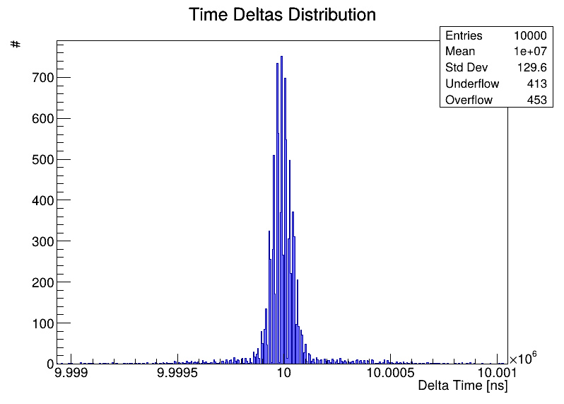
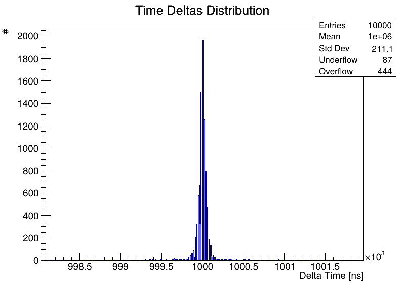
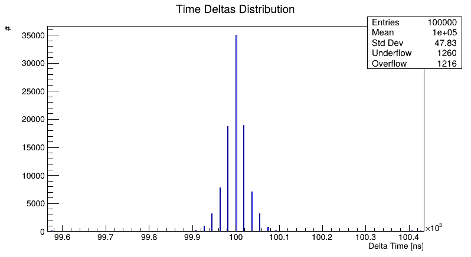

# Raspberry Pi 5 High-Performance GPIO Interrupt Handler

## 📖 Project Overview
This project provides a complete, near-real-time Linux interrupt handling system specifically designed for the Raspberry Pi 5 (BCM2712 / RP1 architecture). 

Standard Linux user-space GPIO libraries suffer from high latency and non-deterministic jitter due to the Completely Fair Scheduler (CFS). This project solves that by using a custom Linux Kernel Module (LKM) to catch the hardware interrupt in Ring 0, paired with CPU core isolation (`isolcpus`) and IRQ affinity. The kernel then instantly wakes up a C++ User Space Application via a `poll()` wait queue, safely passing the data to the main thread using a Lock-Free Ring Buffer.

---

## 🏗️ Architecture

1. **Hardware:** A signal hits the Raspberry Pi 5 GPIO header (routed through the RP1 southbridge via PCIe).
2. **Kernel Space (LKM):** The ISR (Interrupt Service Routine) fires on an isolated CPU core (CPU 3). It records a high-precision nanosecond timestamp and wakes up the user space.
3. **User Space Interface:** A C++ background thread sleeps on a `/dev/rp1_gpio_irq` character device using `poll()`, consuming 0% CPU until the exact microsecond the interrupt arrives.
4. **Data Handling:** The C++ callback pushes the event data into a Single-Producer Single-Consumer (SPSC) Lock-Free Ring Buffer, allowing the main application to read and print the data without blocking the interrupt listener.

---

## ⚙️ System Requirements & Preparation

To achieve true low-latency and low-jitter performance, you must configure the Raspberry Pi OS to isolate a CPU core and prevent the system from moving interrupts around.

### 1. Isolate CPU Core 3
We need to tell the Linux scheduler to keep standard processes off CPU 3.
1. Edit the boot configuration file:
   ~~~bash
   sudo nano /boot/firmware/cmdline.txt
   ~~~
2. Append the following to the end of the existing line (do not create a new line):
   `isolcpus=3`
3. Save and reboot:
   ~~~bash
   sudo reboot
   ~~~

### 2. Disable irqbalance
Prevent the OS from automatically migrating our custom IRQ to other cores.
~~~bash
sudo systemctl stop irqbalance
sudo systemctl disable irqbalance
~~~

---

## Build & Installation

### Dependencies
Ensure you have the required build tools and kernel headers installed:
~~~bash
sudo apt update
sudo apt install build-essential linux-headers-$(uname -r)
~~~

### Step 1: Compile and Load the Kernel Module
Navigate to the directory containing `rpi_fast_irq.c` and its `Makefile`.
~~~bash
# Compile the module
make

# Insert the module into the kernel
sudo insmod rpi_fast_irq.ko

# Verify it loaded correctly
dmesg | tail -n 10
ls -l /dev/rp1_gpio_irq
~~~

### Step 2: Compile and Run the C++ Application
Navigate to the directory containing `main.cpp`, `RpiFastIrq.cpp`, and their `Makefile`.
~~~bash
# Compile the application
make

# Run the application (requires sudo to read the /dev/ file)
sudo ./irq_test
~~~

---

## Configuration Guide

### How to Change the GPIO Pin
The Raspberry Pi 5 uses the RP1 chip for I/O. Logical GPIO numbers might have a base offset assigned by the kernel (e.g., base 512).
1. **Find your RP1 Base:** Run `cat /sys/class/gpio/gpiochip*/label` to find the `pinctrl-rp1` chip. If its base is 512, and you want physical pin 11 (Logical GPIO 17), your target is `512 + 17 = 529`.
2. **Edit the C file:** Open `rpi_fast_irq.c` and locate the `GPIO_PIN` macro:
   ~~~c
   #define GPIO_PIN 17 // Change this to your calculated pin number
   ~~~
3. Recompile and reload the module (`make clean && make`, `sudo rmmod rpi_fast_irq`, `sudo insmod rpi_fast_irq.ko`).

### How to Change the Interrupt Trigger Type
By default, the module triggers on a Rising Edge (0V to 3.3V transition). 
1. Open `rpi_fast_irq.c` and locate the `request_irq` function.
2. Change the `IRQF_TRIGGER_RISING` flag:
   * **Falling Edge:** `IRQF_TRIGGER_FALLING`
   * **Both Edges:** `IRQF_TRIGGER_RISING | IRQF_TRIGGER_FALLING`
   * **High Level:** `IRQF_TRIGGER_HIGH`
   * **Low Level:** `IRQF_TRIGGER_LOW`
3. Recompile and reload the module.

---

## Benchmark Tool & Jitter Analysis

This project includes a high-performance benchmark application designed to measure the time delta between consecutive GPIO interrupts and calculate system jitter. To eliminate disk I/O blocking, the application buffers up to 1,000,000 samples entirely in RAM and writes the dataset to a `.dat` file only upon termination.

### Running the Benchmark
1. Start the application: `sudo ./irq_test`
2. Apply your external signal generator to the configured GPIO pin.
3. Press `ENTER` to begin capturing data.
4. Press `Ctrl+C` to terminate the capture. The application will export a file named `deltaevents_HHMMSS_DDMMYYYY.dat`.

### ROOT CERN Analysis
A ROOT macro (`analyze_jitter.C`) is provided to generate histograms, filter outliers (dropped events), and calculate the mean and standard deviation of the nominal jitter distribution.

To execute the analysis:
~~~bash
root -l 'analyze_jitter.C("deltaevents_HH:MM:SS_DD-MM-YYYY.dat")'
~~~
Note on Quantization: The BCM2712 SoC utilizes a 50 MHz hardware clock for the ARM Generic Timer accessed via ktime_get_ns(). Consequently, all timestamps and calculated deltas possess a strict hardware quantization of 20ns. High-resolution histograms will naturally exhibit 20ns discrete binning. This is physical hardware behavior, not a software flaw.

### Benchmark Results
<table>
<tr>
<td align="center"><b>100 Hz</b></td>
<td align="center"><b>500 Hz</b></td>
</tr>
<tr>
<td></td>
<td></td>
</tr>
<tr>
<td align="center"><b>1 kHz</b></td>
<td align="center"><b>10 kHz</b></td>
</tr>
<tr>
<td></td>
<td></td>
</tr>
</table>

---

## Performance & Latency Estimates

Because this project isolates the CPU and bypasses the standard scheduler, latency is highly deterministic. However, the Raspberry Pi 5 architecture introduces some physical constraints:

* **RP1 PCIe Bus Latency:** Unlike older Pi models, the Pi 5 routes GPIO through the RP1 southbridge over PCIe. This adds a hardware latency of roughly 1 to 3 microseconds.
* **Kernel ISR Context Switch:** Registering the hardware interrupt and executing the ISR takes approximately 2 to 5 microseconds.
* **User Space Wakeup:** The `poll()` wait queue waking up the C++ thread takes roughly 5 to 10 microseconds.
* **Lock-Free Buffer Push:** Writing to the atomic ring buffer takes < 100 nanoseconds.

**Total Estimated End-to-End Latency:** From the physical voltage change on the pin to the C++ callback executing, expect between 10 and 20 microseconds of total delay, with extremely low jitter (variance < 2 microseconds) thanks to `isolcpus`.

---

## Troubleshooting

* **Module fails to load (`insmod: ERROR: could not insert module...`)**: Ensure your kernel headers match your running kernel (`uname -r`). 
* **`poll()` error / File not found**: Ensure the kernel module is loaded before running the C++ app. Check if `/dev/rp1_gpio_irq` exists.
* **Events are dropping (Hardware)**: If the frequency exceeds the kernel's processing capability, the kernel ring buffer will overflow. Increase `KBUF_SIZE` in `rpi_fast_irq.c`.
* **Events are dropping (User Space)**: If the main thread takes too long to process data, the C++ Lock-Free Ring Buffer will fill up. Ensure no synchronous I/O operations block the polling loop.
